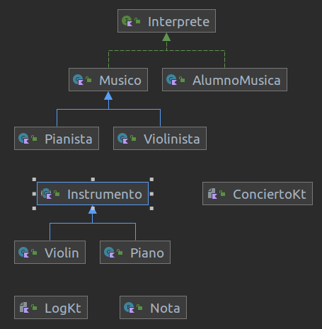

# Prueba especifica unidad 5 y 6

> Se evaluará el RA4 y RA7

## 1. Descripción de la prueba

Tenemos un conjunto de clases que nos permiten simular la realización de un concierto.
- `Log` contiene lo necesario para enviar mensajes de log. No cambiará.
- `Nota` es una clase enumerada para trabajar con las notas musicales. No cambiará.
- `Concierto` tiene el método `main` que ejecuta una prueba de nuestro programa concierto.
- `Piano` representa un instrumento, `melodía` es una lista de notas y el método `play` "las reproduce según el instrumento"
- `Pianista` representa un intérprete, `canción` es una lista de notas y el método `interpretar` toca el instrumento para reproducir las notas.

Actualmente solo se puede dar un concierto del pianista, tocando el piano. Se puede ver en el archivo `Concierto.kt`


## 2. ¿Qué se pide?

1. Un `Pianista`, podrá tocar (método `interpretar`) cualquier instrumento (`Instrumento`)
2. Añadir método `reset` al `Instrumento` para poder limpiar la melodía asociada.
3. Añadir método `incorporaCancion(Array<Nota?>)` para añadir una canción nueva directamente.
4. El método `play` es **específico** de cada instrumento en particular.
5. Por lo pronto, tendremos 2 instrumentos: `Piano`y `Violin`, cada uno con un `play` especializado.
6. Hay que evitar la dependencia que existe entre `Pianista` y `Piano`
7. Hay que documentar la clase `Instrumento`, según las indicaciones de KDoc.
8. Generar la documentación haciendo uso de Dokka.
9. Has ahora se daban concierto monoespecialista, ahora se quiere poder dar conciertos por cualquieer persona que sepa interpretar una obra. `Interprete`.
10. Hay que tener en cuenta que todos los músicos, tendrán un comportamiento común, aunque cada músico sobreescribirá su método `interpretar` (`Musico`)
11. Se quiere poder realizar conciertos por cualquier persona que sepa interpretar una obra. `Interprete`
12. Por lo pronto, tendremos 2 músicos: `Pianista`y `Violinista`, cada uno con un `Interpretar` especializado.
13. Tendremos un `Interprete` no músico, que tambien sabrá tocar `Instrumento`'s 
14. Se puede dar un concierto con multiples especialistas, según el código descrito en el epígrafe siguiente.

## 3. Ejecución y test
La práctica se ejecutará con este código:
```kotlin
fun main() {
    val obra = arrayOf<Nota?>(Nota.MI, Nota.MI, Nota.DO, Nota.FA)
    val interpretes = mutableMapOf(
        "Pianista" to Pianista( Piano(), obra),
        "Violinista" to Violinista( Violin(), obra),
        "AlumnoMusico1" to AlumnoMusica( Violin(), obra),
        "AlumnoMusico2" to AlumnoMusica( Piano(), obra)
    )

    repeat(4)
    {
        interpretes.keys.random().run {
            i("CONCIERTO", this)
            interpretes[this]?.interpretar()
            interpretes.remove(this)
        }
    }
}

```
Y la salida debería ser similar a lo siguiente:
```
####### - SOY PIANISTA
===> Tocando piano
miiii miiii dooo faaa 

####### - SOY VIOLINISTA
===> Tocando violin
miggg miggg doggg faggg 

####### - SOY AlUMNO DE MUSICA
===> Tocando piano
miiii miiii dooo faaa 

####### - SOY AlUMNO DE MUSICA
===> Tocando violin
miggg miggg doggg faggg 

Process finished with exit code 0

```
### Estructura de clases final esperado

La estructura de clase que se espera es la siguiente:

  

## 2. Evaluación

Se tendrá en cuenta el uso de superclases, interfaces, clases abstractas, el uso de jerarquía de clases ya conocidas y que nos las proporcionan kotlin, como por ejemplo List, Map, Set. etc.
Basados en los RA4 y RA7

###### Realizados los puntos del epígrafe 2.
0. No lo hace; 5. mas de la mitad; 10. Completos todos los puntos.
###### Se han diseñado y aplicado jerarquías de clases: Interfaces y clases abstractas, herencia. Según RA4 y RA7
0. No lo hace; 5. Se diseña y aplica jerarquía de clases aplicando polimorfismo pero no adecuadamente o no completa; 10. Correcto.


Adicionalmente se tendrá en cuenta:
- El código realizado es óptimo.
- El código realizado es limpio y está comentado.
- Se cumple requisitos de entrega.

## 3. Condiciones de entrega

Se entrega la URL al repositorio, el repositorio será:

- **privado**
- Compartido conmigo.
- El nombre del repositorio será `DAM1_id_iniciales` donde:
    - `id`: es el ide de la actividad, por ejemplo pe_un5y7
    - `iniciales': son tus iniciales por ejemplo EFO las mías.

## 4. Bibliografía

- [Principio de inversión de dependencias](https://github.com/revilofe/IESRA-DAM-Prog/blob/master/ejercicios/src/main/kotlin/un6/dip/dip.md)
